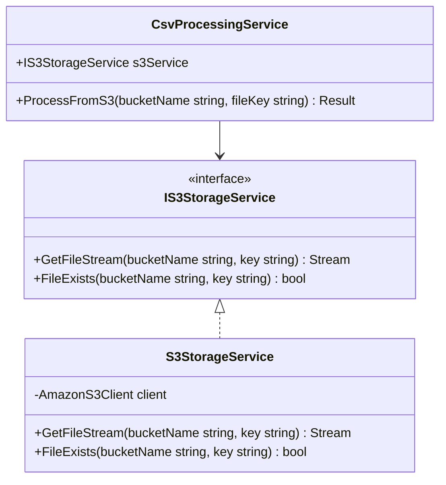
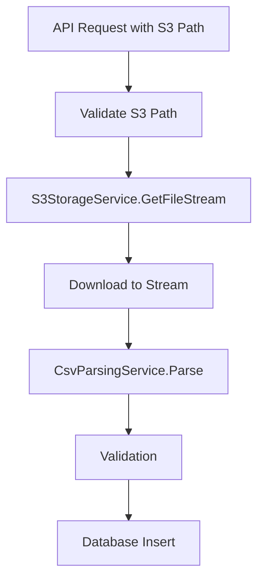

## Context

The current CSV processing implementation accepts file uploads directly through API endpoints. This approach has limitations:

- HTTP request size limits prevent uploading large CSV files
- Memory consumption spikes when processing large files in memory
- Request timeouts occur with slow or large file uploads
- No persistent storage of uploaded files after processing

The application needs to transition to reading CSV files from S3-compatible storage, enabling:
- Scalable file handling regardless of size
- Persistent file storage for retry and audit purposes
- Separation of file upload from processing workflows

## Goals / Non-Goals

**Goals:**
- Enable CSV file processing from S3-compatible storage
- Support LocalStack for local development
- Support Railway Storage Bucket for production deployment
- Maintain existing CSV parsing and validation logic
- Preserve backward compatibility where possible

**Non-Goals:**
- Complete file upload API redesign
- Real-time file streaming optimization
- Multi-bucket support (single bucket per environment)
- S3 write operations (only reading is required)
- User-facing file management UI

## Decisions

### Decision 1: S3 Client Library - AWSSDK.S3 vs MinIO.Client

**Choice:** AWSSDK.S3 (AWS SDK for .NET)

**Rationale:**
- Official AWS SDK with comprehensive S3 support
- Compatible with both AWS S3 and S3-compatible services (LocalStack, Railway)
- Well-maintained and documented
- Battle-tested production quality
- MinIO.Client is primarily for MinIO-specific features we don't need

### Decision 2: Service Abstraction Pattern

**Choice:** Interface-based abstraction with configuration-driven endpoint

**Rationale:**
- Allows swapping S3 providers without code changes
- Configuration in appsettings.json per environment
- Supports LocalStack (local), Railway (production), and AWS (future)
- Follows Clean Architecture principles



### Decision 3: Configuration Structure

**Choice:** Environment-specific appsettings sections

**appsettings.json structure:**
```json
{
  "S3Storage": {
    "ServiceUrl": "${S3_SERVICE_URL}",
    "Region": "${AWS_REGION}",
    "AccessKey": "${AWS_ACCESS_KEY_ID}",
    "SecretKey": "${AWS_SECRET_ACCESS_KEY}",
    "BucketName": "${S3_BUCKET_NAME}"
  }
}
```

**Rationale:**
- Environment variables override for production
- Local development uses LocalStack with default credentials
- Railway Storage Bucket uses its own environment variables

### Decision 4: Local Development with LocalStack

**Choice:** Docker Compose with LocalStack service

**docker-compose.yml addition:**
```yaml
services:
  localstack:
    image: localstack/localstack:latest
    ports:
      - "4566:4566"
    environment:
      - SERVICES=s3
      - DEBUG=1
    volumes:
      - localstack_data:/var/lib/localstack
```

**Rationale:**
- Full S3 emulation without AWS account
- Persists bucket data across restarts
- Matches production S3 API exactly

### Decision 5: Stream-Based Processing

**Choice:** Download file as stream, pipe directly to CSV parser

**Rationale:**
- Memory efficient for large files
- No temporary file storage required
- Immediate processing after download



## Risks / Trade-offs

| Risk | Impact | Mitigation |
|------|--------|------------|
| S3 connectivity failure | Processing fails entirely | Implement retry logic with exponential backoff |
| Large file memory usage | High memory consumption | Stream processing with chunked reads |
| Network latency | Slower processing than local files | Async/await pattern, connection pooling |
| LocalStack API differences | Local dev differs from production | Integration tests against AWS when possible |
| Credentials exposure | Security risk | Use environment variables, never commit secrets |

## Migration Plan

### Phase 1: Infrastructure Setup
1. Add AWSSDK.S3 NuGet package
2. Create IS3StorageService interface and S3StorageService implementation
3. Add LocalStack to docker-compose.yml
4. Configure S3 settings in appsettings.json

### Phase 2: Service Integration
1. Register IS3StorageService in Program.cs
2. Create new ProcessFromS3 method in CsvProcessingService
3. Keep existing file upload method for backward compatibility initially

### Phase 3: Testing
1. Write unit tests for S3StorageService (mock AmazonS3Client)
2. Integration tests with LocalStack
3. Test file processing with various CSV sizes

### Phase 4: Deployment
1. Configure Railway Storage Bucket environment variables
2. Deploy to staging, verify with test files
3. Update documentation
4. Monitor error logs post-deployment
