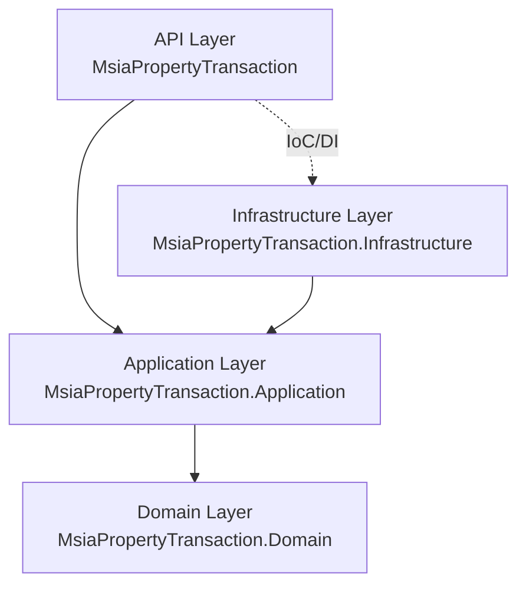

## Context

The codebase currently has three projects:
- `MsiaPropertyTransaction` - API project with controllers, services, and data access mixed together
- `MsiaPropertyTransaction.Domain` - Domain entities (already extracted, dependency-free)
- `MsiaPropertyTransaction.Tests` - Unit and integration tests

The goal is to refactor to Clean Architecture with four distinct layers:
1. **Domain** - Business entities and domain logic (already done)
2. **Application** - Use cases, services, interfaces (DTOs, commands, queries)
3. **Infrastructure** - Data access, EF Core, external services (implements Application interfaces)
4. **API** - Thin controller layer, depends only on Application

## Goals / Non-Goals

**Goals:**
- Create Application layer project with service interfaces and DTOs
- Create Infrastructure layer project with repositories and EF Core
- Move business logic from API to Application layer
- Move data access from API to Infrastructure layer
- Implement architecture tests using ArchUnitNET
- Ensure dependency direction: API → Application → Domain, Infrastructure → Application
- Maintain all existing functionality

**Non-Goals:**
- Changing domain entities or business rules
- Adding new features
- Changing database schema
- Changing API contracts (endpoints, request/response formats)
- Complete rewrite - incremental refactoring of existing code

## Decisions

### Decision: Use Project Structure Following Clean Architecture
**Rationale**: Standard .NET Clean Architecture structure makes the codebase familiar to developers and follows industry best practices.

**Alternative Considered**: Feature-based folder structure
- Rejected: Project-based separation enforces compile-time dependency rules better

### Decision: Use Repository Pattern in Infrastructure Layer
**Rationale**: Abstracts data access details from Application layer, allows for easier testing and potential future database changes.

**Implementation**:
- Define repository interfaces in Application layer (`IPropertyTransactionRepository`)
- Implement in Infrastructure layer using EF Core

### Decision: Use ArchUnitNET for Architecture Tests
**Rationale**: ArchUnitNET is the standard .NET library for architecture testing, similar to ArchUnit in Java. It provides fluent API for expressing architectural rules.

**Rules to enforce**:
- Domain has no project references
- Application depends only on Domain
- Infrastructure depends only on Application and Domain
- API depends only on Application

### Decision: Keep Existing Service Classes, Move to Application Layer
**Rationale**: Minimizes risk by not rewriting logic, just relocating it to the correct layer.

**Migration approach**:
1. Extract interfaces from existing services
2. Move interfaces to Application layer
3. Move implementations to Application layer
4. Update API to depend on interfaces

### Decision: Use Dependency Injection for Layer Composition
**Rationale**: Clean Architecture relies on Dependency Inversion Principle. Infrastructure implements interfaces defined in Application.

**Registration**:
- Infrastructure services registered in API's Program.cs
- Allows API to remain unaware of Infrastructure implementation details

## Risks / Trade-offs

**Risk**: Breaking changes during refactoring  
→ **Mitigation**: Comprehensive test suite must pass after each step; run all tests frequently

**Risk**: Circular dependency between layers  
→ **Mitigation**: Architecture tests will catch this; strict layer discipline required

**Risk**: Increased project complexity (more projects to manage)  
→ **Mitigation**: Clear naming conventions; solution folders in .sln file; worth the trade-off for maintainability

**Risk**: Existing tests may need updating due to namespace changes  
→ **Mitigation**: Update using statements; test logic should remain unchanged

**Risk**: Domain layer already exists but may have dependencies we don't see  
→ **Mitigation**: Architecture tests will verify Domain has zero dependencies

## Migration Plan

### Phase 1: Create Projects
1. Create `MsiaPropertyTransaction.Application` class library
2. Create `MsiaPropertyTransaction.Infrastructure` class library
3. Set up project references: Application → Domain, Infrastructure → Application
4. Update solution file

### Phase 2: Move Data Access to Infrastructure
1. Move `AppDbContext` from API to Infrastructure
2. Create `IPropertyTransactionRepository` interface in Application
3. Implement repository in Infrastructure
4. Update service to use repository interface

### Phase 3: Move Services to Application
1. Move `PropertyTransactionService` to Application layer
2. Move `CsvValidationService` to Application layer
3. Move `CsvParsingService` to Application layer
4. Define interfaces in Application layer:
   - `IPropertyTransactionService`
   - `ICsvValidationService`
   - `ICsvParsingService`
   - `IPropertyTransactionRepository`
5. Make services implement their respective interfaces
6. Update API controllers to depend on interfaces

### Phase 4: Update API Project
1. Remove service implementations from API
2. Keep only controllers and DI registration
3. Register Infrastructure services in Program.cs
4. Update namespaces and usings

### Phase 5: Architecture Tests
1. Add ArchUnitNET package to test project
2. Create `ArchitectureTests.cs` with layer dependency rules
3. Verify all rules pass

### Rollback Strategy
- Each phase is committed separately
- If issues arise, revert to previous commit
- Tests must pass before proceeding to next phase
